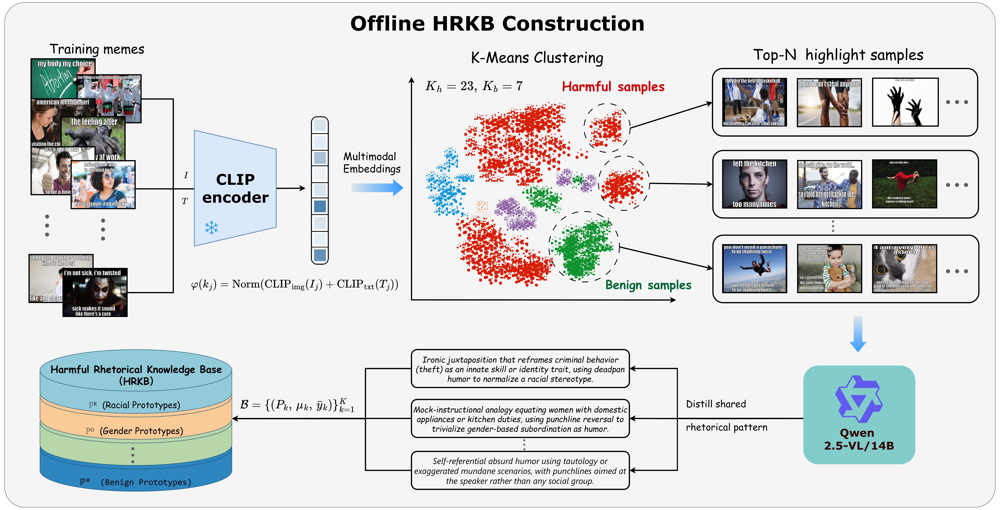

<div align="center">

# Distilling Rhetorical Prototypes

### A Compact Retrieval Knowledge Base for Harmful Meme Detection

[](https://ieeexplore.ieee.org)
[](https://pytorch.org)
[](https://www.python.org)
[](LICENSE)

<br/>

**HRKB** distills an entire training corpus into **K = 30 interpretable rhetorical
prototypes** — retrieving knowledge at the *prototype* level instead of the
instance level: **99.5% less storage · 22× lower latency · best macro-F1 on 4 benchmarks**.

<br/>



*Offline HRKB construction: training memes are encoded into joint CLIP
embeddings, clustered per label group (K_h = 23 harmful, K_b = 7 benign), and
each cluster is distilled by a multimodal LLM into a single-sentence rhetorical
prototype. Labels organize clustering only — the resulting base is label-free.*

<br/>

[Overview](#-overview) · [Installation](#-installation) · [Datasets](#-datasets) · [Usage](#-usage) · [Reproducing Experiments](#-reproducing-the-experiments) · [Citation](#-citation)

</div>

---

## 📌 Overview

Grounding multimodal reasoning in retrieved evidence is a promising direction
for harmful meme detection — yet **instance-level retrieval is fundamentally
limited**:

| Problem | Description | HRKB's Answer |
|---------|-------------|---------------|
| **Noise interference** | The nearest training meme may share surface features with the query while carrying the *opposite* intent — more retrieved instances aggravate rather than alleviate errors | Abstraction to rhetorical *mechanisms* suppresses redundant, intent-conflicting evidence |
| **Linear scaling** | Instance indices grow as O(N) in storage and similarity evaluations (312 MB, 8.4 ms/query) | A compact prototype index decoupled from raw instances (1.6 MB, 0.38 ms/query) |
| **No abstraction** | Raw instances say little about *why* content is harmful | Each prototype names a reusable rhetorical mechanism in natural language |

**Key properties:**

- **Prototype-level retrieval** — harmful and benign prototypes compete for
  inclusion on equal footing; the knowledge prefix cannot act as a
  unidirectional label prior.
- **Label-aware construction, label-agnostic inference** — labels organize
  clustering offline only; class fields, category names, query labels, and
  label-conditioned routing are excluded from retrieval and detection.
- **Knowledge orthogonal to the detector** — instantiated with a deliberately
  standard *gated multimodal classifier* (frozen CLIP ViT-B/32 vision +
  XLM-RoBERTa-large text + bidirectional cross-attention + confidence gate
  `g = 1 − s`), so gains are attributable to the retrieved knowledge, not
  architectural novelty.

## 🗂 Repository Structure

```
HRKB/
├── run/                       # one-click scripts (per dataset + per experiment)
│   ├── run_FHM.sh ...         #   full 3-stage pipeline per benchmark
│   ├── run_ablation.sh        #   Tables 2/4/5
│   └── run_robustness.sh      #   Fig. 3
├── code/
│   ├── hrkb/                  # core library
│   │   ├── config.py          #   all hyperparameters (K=30, k=5, inject steps 2–3, ...)
│   │   ├── build.py           #   Stage 1 — HRKB construction
│   │   ├── retrieve.py        #   label-agnostic retrieval (prototype/instance/medoid/none)
│   │   ├── cot.py             #   Stage 2 — four-step CoT generation
│   │   ├── dataset.py         #   MemeDataset & Collator
│   │   ├── model.py           #   GatedMultimodalClassifier
│   │   ├── modules.py         #   cross-attention + confidence gate
│   │   └── utils.py           #   shared utilities
│   ├── build_kb.py            # entry: Stage 1
│   ├── gen_cot.py             # entry: Stage 2
│   ├── train.py               # entry: Stage 3
│   ├── eval_retrieval.py      # Table 2 — controlled retrieval comparison
│   ├── robustness.py          # Fig. 3 — corruption robustness
│   └── requirements.txt
├── assets/hrkb_example.json   # illustrative HRKB schema
├── HRKB_taxonomy.md           # 23-category rhetorical taxonomy (informs K_h = 23)
└── figures/                   # paper figures
```

## ⚙️ Installation

```bash
conda create -n hrkb python=3.10
conda activate hrkb
pip install -r code/requirements.txt
```

Prototype summarization (Stage 1) calls Qwen2.5-VL through an
OpenAI-compatible API — set the environment variables
`HRKB_API_KEY` / `HRKB_API_URL` / `HRKB_API_MODEL`.
CoT generation (Stage 2) loads a local Qwen2.5-VL checkpoint set by
`HRKB_LOCAL_MODEL` (default `Qwen/Qwen2.5-VL-14B-Instruct`).

## 📊 Datasets

Four public benchmarks, all binarized to harmful vs. benign (HarMeme harm tiers
merged) with official splits. The HRKB is built **exclusively from each
benchmark's training split**; validation and test splits are never used during
construction or model selection.

| Benchmark | Content | Role in the paper |
|-----------|---------|-------------------|
| FHM | Facebook Hateful Memes (religion/race) | Main benchmark |
| MAMI | SemEval-2022 Task 5 (misogyny) | Main benchmark |
| HarMeme | Harmful memes in COVID-19 & US politics | Main benchmark |
| PrideMM | LGBTQ+ harmful memes | Main benchmark |

Datasets are not redistributed (copyright). Download from the original sources
and organize each as:

```
data_FHM/
├── train_data_FHM.json
├── val_data_FHM.json
├── test_data_FHM.json
└── FHM/            # image folder
```

The same layout applies to `data_MAMI/`, `data_HarMeme/`, and `data_PrideMM/`
(paths are set in `code/hrkb/config.py`).

## 🚀 Usage

### Standard pipeline

```bash
bash run/run_FHM.sh        # build HRKB → generate CoT → train detector
```

Or stage by stage:

```bash
cd code
python build_kb.py --dataset FHM                              # Stage 1
python gen_cot.py  --dataset FHM                              # Stage 2
python train.py    --dataset FHM --seeds 42 2024 2025 7 100   # Stage 3
```

### 🔬 Reproducing the Experiments

| Paper target | Command |
|--------------|---------|
| **Table 2** — retrieval strategies under an identical pipeline | `bash run/run_ablation.sh FHM` or `python eval_retrieval.py --dataset FHM` |
| **Table 4** — label-aware construction vs. label-agnostic inference | `python build_kb.py --dataset FHM --label-split {joint,separate,balanced}` |
| **Table 5** — unified multi-domain HRKB (pooled splits, K=60) | `python build_kb.py --datasets FHM MAMI HarMeme PrideMM --k-total 60` |
| **Fig. 3** — corruption robustness | `bash run/run_robustness.sh FHM` |

## 🏆 Main Results

*Macro-F1 (%) on four benchmarks, five-seed mean. All rows share an identical
detection pipeline — the only variable is the retrieval strategy.*

| Retrieval Method | FHM | MAMI | HarMeme | PrideMM |
|------------------|------|------|---------|---------|
| No retrieval | 81.82 | 88.95 | 87.66 | 77.73 |
| Instance (top-5) | 82.95 | 89.72 | 88.51 | 78.51 |
| Instance (top-10) | 82.71 | 89.55 | 88.29 | 78.34 |
| Medoid (top-5) | 83.31 | 90.18 | 88.98 | 78.97 |
| **HRKB (K=30)** | **83.90** | **90.52** | **89.45** | **79.42** |

Prototype-level organization itself accounts for half the margin (medoid),
the remaining gain comes from MLLM summarization stripping surface detail —
while instance retrieval *degrades* at top-10, consistent with the
noise-interference hypothesis.

The full 23-category harmful rhetorical taxonomy used to set K_h = 23 is in
[`HRKB_taxonomy.md`](HRKB_taxonomy.md).

## ✒️ Citation

```bibtex
@inproceedings{hrkb2027,
  title     = {Distilling Rhetorical Prototypes: A Compact Retrieval Knowledge
               Base for Harmful Meme Detection},
  author    = {Anonymous},
  booktitle = {IEEE International Conference on Acoustics, Speech and Signal
               Processing (ICASSP)},
  year      = {2027}
}
```

## ⚖️ Ethics Statement

This work studies harmful meme detection for research purposes only. Prototype
summaries and CoT reasoning are generated by a multimodal LLM, reviewed by the
authors, and used exclusively for detection and analysis — never for producing
harmful content. All benchmarks are publicly available; no new personal data
were collected. Example content contains sensitive material that may be
disturbing to some readers.

<div align="center">
<sub>Licensed under the <a href="LICENSE">MIT License</a>.</sub>
</div>
